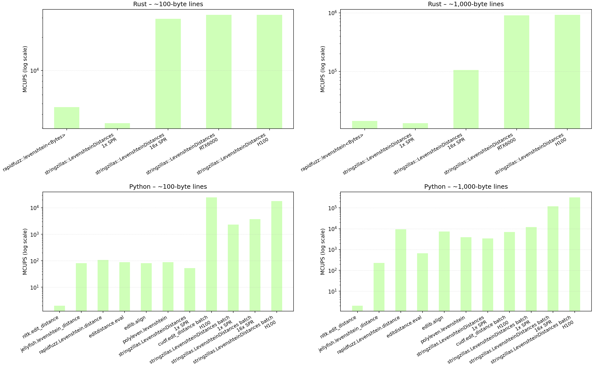
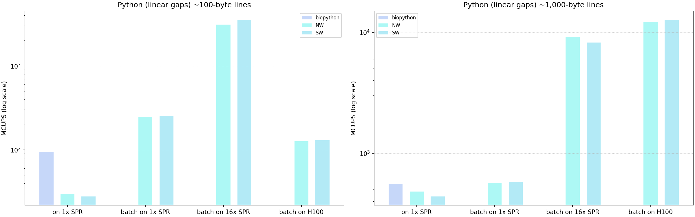

# StringZilla: GPU-accelerated string processing

| **Long story short** | **StringZilla** |
|---|---|
| StringZilla v4 ([the StringWa.rs release](https://ashvardanian.com/posts/stringwars-on-gpus/#traditional-string-similarity-measures)) was engineered to move classic dynamic-programming string- and sequence-comparison kernels onto GPUs. As a result, throughput for edit-distance and alignment tasks was increased by orders of magnitude versus single-core CPU runs, making proteome-scale pairwise scoring, library-scale deduplication and other previously HPC-bound workloads practical to run on cloud GPU infrastructure. | [StringZilla](https://github.com/ashvardanian/StringZilla) is a CUDA-capable, SIMD-first library for high-throughput string and biological sequence processing. The library re-implements Levenshtein, Needleman-Wunsch and Smith-Waterman (with Gotoh affine gaps) as GPU-friendly kernels, adds high-performance hashing/fingerprinting primitives and exposes fast, reproducible baselines for deduplication, similarity search and alignment tasks used in databases, Information Retrieval and bioinformatics. |

## Bioinformatics applications and impact

Massive sequence comparison workloads (read alignment, long-read error detection, protein similarity searches, deduplication and large-scale variant matching) were identified as direct beneficiaries of the library’s GPU kernels. For bioinformatics pipelines that compute a large number of pairwise dynamic programming (DP) scores or perform local alignments (Smith-Waterman) with affine-gap penalties, DP evaluation is the main computational bottleneck - moving these kernels to GPUs removes that bottleneck while preserving biologically meaningful scoring (substitution matrices and affine-gap penalties). This makes exploratory analyses (large-scale pairwise similarity, proteome-scale scans, and library deduplication) dramatically faster.

## Algorithm implementation and optimizations

SZv4's GPU optimization is based on re-ordering DP along anti-diagonals to expose massive SIMD/GPU parallelism, leveraging accelerator primitives (e.g., DP4A/DPX) and diagonal-tiling/masked-load techniques for affine-gap alignments, and keeping those alignment kernels separate from a distinct high-throughput fingerprinting pillar (AES-based streaming hashing, vector-friendly 52-bit MinHash) plus a set of string utilities (fast hashing, prefix-based sort/argsort).

### Sequence Alignment (Target: GPU)

Classic DP (Wagner-Fischer) is row-sequential and blocks vectorization; StringZilla v4 (SZv4) reorders the computation along anti-diagonals so each diagonal depends only on the two previous diagonals - this preserves correctness while exposing fine-grained SIMD / GPU parallelism. Affine gaps are implemented with the three canonical DP matrices (match/mismatch, gap-open, gap-extend), and protein scoring uses native 20x20 substitution matrices. Kernels are tuned for accelerator throughput (diagonal-oriented layouts, tiling, masked/predicated loads) and inner loops leverage NVIDIA small-integer dot-product primitives (DP4A / DPX-style) to speed quantized DP.

### Fingerprinting features (Target: AES = CPU; MinHash = GPU/CPU)

Fingerprinting is a separate performance pillar. A bespoke AES-based hash was built for both short-line latency and long-stream throughput: it supports streaming updates and per-seed influence, uses ISA dynamic dispatch for identical cross-platform outputs, fuses AES rounds with SIMD shuffles/adds, uses larger states/blocks for inputs >64 B, and relies on masked/predicated loads for uniform per-byte weighting (benchmarks: \~1.84 GiB/s on short lines, \~11.23 GiB/s on long streams). MinHash uses a vector-friendly trick based on IEEE double precision (52 usable bits) to implement 52-bit integer-style mixing/rolling hashes so CPU and GPU kernels stay vectorizable and numerically consistent - delivering large accelerator speedups in practice (author tests: single-threaded Rust \~0.5 MiB/s vs H100 GPU \~392.37 MiB/s) while keeping competitive collision/entropy properties.

### General-purpose hashing and string sorting (Target: CPU)

SZv4 also ships high-throughput GP string utilities (fast hashing, prefix-based string sort/argsort). These general utilities (useful for deduplication and batch prefiltering) are intentionally documented and benchmarked separately from the Alignment and Fingerprinting pillars (example: `sz::argsort_permutation` \~182.9M comparisons/s vs `std::sort_unstable_by_key` \~54.4M).

## Performance

### Edit Distance

Edit distance computation is widely used in search engines, data cleaning, natural language processing, and bioinformatics. It’s computationally intensive—typically implemented with dynamic programming and a worst-case quadratic time complexity. For \~1,000-byte lines in Rust, StringZilla’s implementation outperforms `rapidfuzz::levenshtein<Bytes>` by roughly 63x on an RTX6000 and 65x on an H100.

NLTK – despite >1B downloads – only manages \~2 MCUPS. RapidFuzz (Python) is faster; StringZilla’s very thin C->Python bindings keep overhead minimal and push performance close to native. With prebuilt cudf.Series, cudf.edit_distance scores 24,754 / 6,976 / 1,447 MCUPS for \~100 / 1,000 / 10,000-byte strings, while StringZilla Python scores 18,081 / 320,109 / 157,968 MCUPS – roughly 46x faster at \~1,000 bytes and 109x faster at \~10,000 bytes versus cudf.

*Figure: Comparative MCUPS (log scale) for edit distance: Rust / Python, \~100-byte and \~1,000-byte workloads, measured on CPU nodes and GPUs.*

### Substitution Costs and Affine Gap Penalties

Needleman-Wunsch and Smith-Waterman are better suited for biological sequences because they let you use custom substitution scores (e.g., BLOSUM/PAM). It’s also common to adopt Gotoh’s affine-gap model (gap-open + gap-extend) to more realistically represent indel events in DNA and protein evolution.

Compared with Biopython’s PairwiseAligner.score on 1x SPR (95 MCUPS for \~100-byte lines and 557 MCUPS for \~1,000-byte lines), StringZilla’s SmithWatermanScores batch on 16x SPR hits 3,535 MCUPS on \~100-byte lines – about 37x faster; StringZilla’s SmithWatermanScores batch on H100 reaches 12,702 MCUPS on \~1,000-byte lines – about 23x faster.

*Figure: Comparative MCUPS (log scale) for substitution edit distance: Python (linear gaps), \~100-byte and \~1,000-byte workloads, measured on CPU nodes and GPUs. Bioptyhon: biopython.PairwiseAligner.score, NW: stringzillas::NeedlemanWunschScores, SW: stringzillas::SmithWatermanScores.*

## Infrastructure and reproducibility

The benchmarks were run on Nebius cloud GPU instances provisioned with Nvidia Hopper-based H100 and Blackwell-based RTX 6000 Pro GPUs. CPU baselines were measured on Intel Sapphire Rapids (SNR) and Granite Rapids (GNR) CPUs. CUDA-enabled toolchains and platform-specific wheels were built and deployed via GitHub Actions to ensure consistent runtime environments across machines. RAPIDS (`cudf` / `nvtext`) was used as a representative GPU-enabled comparison stack and Biopython was used as a representative single-core CPU baseline for protein alignment workloads.

## Future roadmap and next steps

Planned work will focus on broadening platform support, scaling to multi-GPU and distributed deployments, optimizing memory and data layouts, and adding multiple-sequence alignment capabilities:

* Support for additional GPU backends will be expanded, including ROCm for AMD accelerators, so users on diverse cloud platforms can run GPU-accelerated kernels.

* Multi-GPU and distributed execution modes will be implemented to enable very large-scale pairwise scoring and batch alignment across nodes.

* Memory and data-layout optimizations will be applied (for example, moving substitution matrices out of constant memory into tiled/texture-backed layouts) to remove current bottlenecks.

* A multiple-sequence-alignment (MSA) algorithm will be developed and integrated to broaden the library’s applicability to more complex alignment tasks.

These items will be pursued while leveraging Nebius’ cloud GPU infrastructure to validate performance at scale and to ensure the work remains practical and reproducible for the broader bioinformatics community.